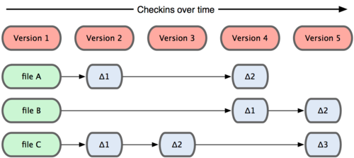

# How Jiaozifs storage works

## Jiaozifs Object

JiaoziFS's local storage is similar to how data is stored in **Git**. At the core of **Git** is a simple **key-value data store**. You can insert any type of content into a **Git** repository, and it will return a unique key that allows you to retrieve that content at any time. JiaoziFS's local storage operates in the same way.

## JiaoziFS With Other Tools

**Jiaozifs** is an open-source project that facilitates data management in **AWS S3**, **Azure Blob Storage**, **Google Cloud Storage (GCS)**, and any other object storage with an **S3 interface**.

